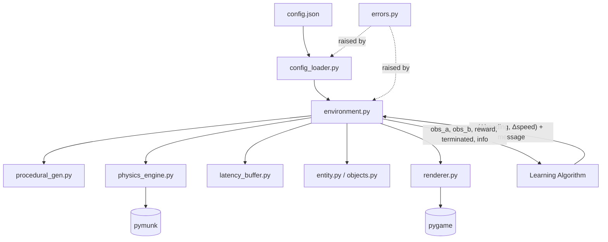

# Design Document: Continuous Physics-Based Dec-POMDP Environment

## Overview

This document describes the technical design for the continuous physics-based asymmetric Dec-POMDP environment. The system simulates a continuous 2D world in which two agents with strictly asymmetric roles cooperate to capture a target via a latency-buffered communication channel.

The environment is formalized as the tuple ⟨𝒮, 𝒜, 𝒵, 𝒯, 𝒪, ℛ, γ⟩ where:

- **𝒮**: Continuous 2D world of dimensions `world_width × world_height` (floating-point units) with geometric obstacles and a target
- **𝒜 = 𝒜_A × 𝒜_B**: Agent A has no movement action (pure communicator); Agent B steers via `(Δheading, Δspeed)` pairs
- **𝒵 = 𝒵_A × 𝒵_B**: Agent A observes full state z_A = s; Agent B observes nothing z_B = ∅
- **𝒯**: Continuous transition dynamics via pymunk physics integration
- **𝒪**: Asymmetric observation function
- **ℛ**: Joint reward on capture (Euclidean distance ≤ `capture_radius`)
- **γ**: Discount factor (external to environment)

The environment is fully decoupled from any learning algorithm. All parameters are loaded from a JSON config file at initialization. Rendering is optional via Pygame and incurs zero overhead when disabled.

### Key Design Goals

- Continuous 2D physics via pymunk (Chipmunk-based) for realistic collision detection and response
- Velocity-based steering: Agent B maintains heading and speed state; actions are incremental changes
- Three geometric obstacle types: rectangular walls, circular pillars, convex polygons
- Capture by Euclidean distance rather than cell overlap
- Strict separation between environment logic and learning code
- Reproducible episodes via seeded procedural generation
- Correct FIFO latency buffer implementing τ-step message delay
- Optional Pygame renderer with zero import cost when disabled

---

## Architecture

The environment is implemented as a set of Python modules with clear single responsibilities. No module imports from learning algorithm code.



### Module Responsibilities

| Module | Responsibility |
|---|---|
| `config_loader.py` | Parse and validate JSON config; raise descriptive errors on missing/invalid fields |
| `entity.py` | Base `Entity` dataclass with id, float position, `static`, `collidable` flags |
| `objects.py` | Concrete entity types: `AgentA`, `AgentB`, `Obstacle`, `Target` |
| `physics_engine.py` | Wrap pymunk space; register bodies/shapes; advance simulation; query positions |
| `procedural_gen.py` | Seeded random placement of all entities with separation and overlap checks |
| `latency_buffer.py` | FIFO deque implementing τ-step message delay |
| `environment.py` | Orchestrate the step pipeline, reset, and episode lifecycle |
| `renderer.py` | Optional Pygame window; imported only when `render=true` in config |
| `errors.py` | Custom exception hierarchy |

---

## Components and Interfaces

### ConfigLoader

```python
class ConfigLoader:
    @staticmethod
    def load(path: str) -> EnvConfig:
        """Read and validate JSON config. Raises FileNotFoundError or
        ConfigValidationError (message contains the offending field name)."""
```

### Environment

```python
class DecPOMDPEnvironment:
    def __init__(self, config_path: str) -> None: ...

    def reset(self, seed: int | None = None) -> tuple[ObsA, ObsB]:
        """Clear all state, re-run procedural generation, return initial obs."""

    def step(
        self,
        action_b: tuple[float, float],   # (Δheading, Δspeed)
        message_a: list[float],           # length-16 vector
    ) -> StepResult:
        """Advance simulation by one timestep. Raises EpisodeTerminatedError
        if called on a terminated episode."""

    def state_dict(self) -> dict:
        """Return full current state as a structured dictionary."""
```

`StepResult = namedtuple("StepResult", ["obs_a", "obs_b", "reward", "terminated", "info"])`

The delayed message is returned in `info["message"]` so the learning algorithm can feed it to Agent B's policy.

### Entity Hierarchy

```
Entity (abstract dataclass)
├── AgentA    static=True,  collidable=False  (stationary observer)
├── AgentB    static=False, collidable=True   (dynamic actor, circular body)
├── Obstacle  static=True,  collidable=True   (rect / circle / polygon)
└── Target    static=True,  collidable=False  (capture by distance, not collision)
```

```python
@dataclass
class Entity:
    id: str
    x: float
    y: float
    static: bool
    collidable: bool
```

`AgentB` extends `Entity` with:

```python
@dataclass
class AgentB(Entity):
    heading: float = 0.0   # radians, measured from positive x-axis
    speed:   float = 0.0   # current scalar speed
    vx:      float = 0.0   # derived: speed * cos(heading)
    vy:      float = 0.0   # derived: speed * sin(heading)
```

`Obstacle` extends `Entity` with a `shape_def` field:

```python
@dataclass
class Obstacle(Entity):
    shape_def: RectDef | CircleDef | PolygonDef = field(default_factory=...)
```

### PhysicsEngine

```python
class PhysicsEngine:
    def __init__(self, config: EnvConfig) -> None:
        """Create pymunk Space; add boundary segment shapes."""

    def add_agent_b(self, x: float, y: float, agent_radius: float) -> None:
        """Create dynamic circular body for Agent B."""

    def add_obstacle(self, shape_def: RectDef | CircleDef | PolygonDef) -> None:
        """Create static shape for an obstacle and add to space."""

    def set_velocity(self, vx: float, vy: float) -> None:
        """Set Agent B's velocity on its physics body."""

    def step(self, dt: float = 1.0) -> None:
        """Advance pymunk space by dt. Resolves all collisions."""

    def get_agent_b_position(self) -> tuple[float, float]:
        """Query Agent B's position from pymunk after integration."""

    def get_agent_b_velocity(self) -> tuple[float, float]:
        """Query Agent B's actual velocity after collision response."""

    def reset(self) -> None:
        """Remove all bodies and shapes; recreate boundary segments."""
```

### LatencyBuffer

```python
class LatencyBuffer:
    def __init__(self, tau: int, message_dim: int = 16) -> None:
        """FIFO deque of capacity tau + 1."""

    def push(self, message: list[float]) -> None:
        """Enqueue message."""

    def pop(self) -> list[float]:
        """Dequeue oldest message. Returns [0.0]*16 until tau messages
        have been pushed (early-episode zero padding)."""

    def clear(self) -> None:
        """Reset buffer to empty state."""
```

### ProceduralGenerator

```python
class ProceduralGenerator:
    def __init__(self, config: EnvConfig) -> None: ...

    def generate(self, seed: int) -> GeneratedLayout:
        """Place Agent_A, Agent_B, Target, and Obstacles at valid float
        positions. Guarantees:
          - All positions within world bounds
          - No obstacle overlaps spawn positions
          - dist(Agent_B, Target) > capture_radius
          - dist(Agent_B, Target) >= min_separation (if configured)
        Returns GeneratedLayout(agent_a, agent_b, target, obstacles).
        Raises GenerationFailedError if constraints cannot be satisfied
        within retry budget."""
```

Uses `random.Random(seed)` (not global state) for full reproducibility.

### Renderer

```python
class Renderer:
    def __init__(self, config: EnvConfig) -> None:
        """Open Pygame window sized to world_width × world_height (or scaled)."""

    def draw(self, state: dict) -> bool:
        """Render current state. Returns False if window was closed."""

    def close(self) -> None:
        """Destroy Pygame window and quit."""
```

The `Renderer` class is only imported inside `environment.py` when `config.render is True`, so Pygame is never imported in headless runs.

### Observation Interface

```python
# Agent A: full environment state
ObsA = TypedDict("ObsA", {
    "agent_a":   tuple[float, float],
    "agent_b":   tuple[float, float],
    "agent_b_velocity": tuple[float, float],
    "target":    tuple[float, float],
    "obstacles": list[dict],   # each dict: {"type": str, **shape_params}
    "timestep":  int,
})

# Agent B: empty (no environment state)
ObsB = {}   # type: dict  (always empty)
```

Obstacle geometry in `obs_a["obstacles"]` uses the same schema as the config:
- Rect: `{"type": "rect", "cx": float, "cy": float, "width": float, "height": float, "angle": float}`
- Circle: `{"type": "circle", "cx": float, "cy": float, "radius": float}`
- Polygon: `{"type": "polygon", "vertices": [[float, float], ...]}`

---

## Data Models

### EnvConfig (dataclass)

```python
@dataclass
class EnvConfig:
    # World
    world_width:          float
    world_height:         float
    # Physics
    agent_radius:         float
    max_speed:            float
    max_angular_velocity: float
    capture_radius:       float
    # Episode
    random_seed:          int
    max_steps:            int
    tau:                  int
    min_separation:       float   # default 0.0
    # Obstacles
    obstacles:            list[dict]   # explicit list OR empty if procedural
    procedural:           dict | None  # procedural generation params, or None
    # Rendering / debug
    render:               bool   # default False
    log_level:            str    # "DEBUG" | "INFO" | "WARNING"
```

### JSON Config Schema

```json
{
  "world_width": 800.0,
  "world_height": 600.0,
  "agent_radius": 10.0,
  "max_speed": 150.0,
  "max_angular_velocity": 0.2,
  "capture_radius": 20.0,
  "random_seed": 42,
  "max_steps": 500,
  "tau": 3,
  "min_separation": 100.0,
  "obstacles": [
    {"type": "rect",    "cx": 200.0, "cy": 300.0, "width": 60.0, "height": 20.0, "angle": 0.0},
    {"type": "circle",  "cx": 500.0, "cy": 200.0, "radius": 30.0},
    {"type": "polygon", "vertices": [[400,100],[450,150],[380,160]]}
  ],
  "render": false,
  "log_level": "INFO"
}
```

Required fields: `world_width`, `world_height`, `agent_radius`, `max_speed`, `max_angular_velocity`, `capture_radius`, `random_seed`, `max_steps`, `tau`.

Optional fields with defaults: `min_separation` (0.0), `obstacles` ([]), `procedural` (null), `render` (false), `log_level` ("INFO").

### Obstacle Shape Definitions

```python
@dataclass
class RectDef:
    cx: float; cy: float
    width: float; height: float
    angle: float   # radians

@dataclass
class CircleDef:
    cx: float; cy: float
    radius: float

@dataclass
class PolygonDef:
    vertices: list[tuple[float, float]]   # ordered, convex
```

### Action Space

Agent B's action is a continuous pair `(Δheading, Δspeed)`:

| Component | Type | Semantics | Clamping |
|---|---|---|---|
| `Δheading` | `float` (radians) | Change in heading direction | Clamped to `[−max_angular_velocity, +max_angular_velocity]` |
| `Δspeed` | `float` (world units/step) | Change in scalar speed | Result clamped to `[0, max_speed]` |

After clamping, the new velocity vector is computed as:
```
heading_new = heading + clamp(Δheading, ±max_angular_velocity)
speed_new   = clamp(speed + Δspeed, 0, max_speed)
vx = speed_new * cos(heading_new)
vy = speed_new * sin(heading_new)
```

### Step Pipeline (ordered)

```
step(action_b, message_a):
  1. Validate episode is active; raise EpisodeTerminatedError if not
  2. Validate len(message_a) == 16; raise MessageDimensionError if not
  3. latency_buffer.push(message_a)
  4. delayed_msg = latency_buffer.pop()
  5. Δheading, Δspeed = action_b
     heading = heading + clamp(Δheading, ±max_angular_velocity)
     speed   = clamp(speed + Δspeed, 0, max_speed)
     vx, vy  = speed * cos(heading), speed * sin(heading)
  6. physics_engine.set_velocity(vx, vy)
     physics_engine.step(dt=1.0)
  7. x, y   = physics_engine.get_agent_b_position()
     vx, vy = physics_engine.get_agent_b_velocity()
     agent_b.x, agent_b.y, agent_b.vx, agent_b.vy = x, y, vx, vy
  8. timestep += 1
  9. reward, terminated = compute_reward_and_termination()
  10. if renderer: renderer.draw(state_dict())
  11. obs_a, obs_b = generate_observations()
  12. return StepResult(obs_a, obs_b, reward, terminated, {"message": delayed_msg})
```

### Reward and Termination Logic

```
compute_reward_and_termination():
  dist = sqrt((agent_b.x - target.x)^2 + (agent_b.y - target.y)^2)
  if dist <= capture_radius:          # Capture by Euclidean distance
    return (+1.0, True)
  if timestep >= max_steps:           # Timeout
    return (0.0, True)
  return (0.0, False)                 # Ongoing
```

---

## Correctness Properties

*A property is a characteristic or behavior that should hold true across all valid executions of a system — essentially, a formal statement about what the system should do. Properties serve as the bridge between human-readable specifications and machine-verifiable correctness guarantees.*

### Property 1: Config Error Names the Offending Field

*For any* required config field, if that field is absent or has an invalid type in the JSON config, the `ConfigValidationError` raised SHALL contain the name of that field in its message.

**Validates: Requirement 1.5**

---

### Property 2: Reproducibility — Same Seed Produces Identical Layout

*For any* valid config and any integer seed, calling `reset(seed)` twice SHALL produce identical entity positions for all entities (Agent_A, Agent_B, Target, all Obstacles).

**Validates: Requirements 1.6, 7.3, 7.4, 13.4**

---

### Property 3: All Entities Within World Bounds After Reset

*For any* valid config and any seed, after `reset()`, every entity's (x, y) position SHALL satisfy `0.0 ≤ x ≤ world_width` and `0.0 ≤ y ≤ world_height`.

**Validates: Requirements 2.1, 7.1**

---

### Property 4: Agent_B Velocity Magnitude Never Exceeds max_speed

*For any* sequence of `(Δheading, Δspeed)` actions applied to Agent_B, the magnitude `sqrt(vx² + vy²)` SHALL never exceed `max_speed`.

**Validates: Requirement 5.2**

---

### Property 5: Heading Change Clamped to max_angular_velocity

*For any* action with `Δheading` of arbitrary magnitude, the absolute change in Agent_B's heading per step SHALL not exceed `max_angular_velocity`.

**Validates: Requirement 5.2**

---

### Property 6: Physics Engine Prevents Penetration

*For any* sequence of steps, Agent_B's circular body SHALL never overlap an Obstacle shape or world boundary by more than a negligible numerical tolerance (≤ 0.01 world units).

**Validates: Requirements 4.5, 5.5**

---

### Property 7: Boundary Containment

*For any* sequence of steps, Agent_B's position SHALL satisfy `agent_radius ≤ x ≤ world_width − agent_radius` and `agent_radius ≤ y ≤ world_height − agent_radius`.

**Validates: Requirements 2.6, 4.4**

---

### Property 8: Initialization Separation Invariant

*For any* valid config and any seed, after `reset()`, the Euclidean distance between Agent_B's initial position and the Target's position SHALL be greater than `capture_radius`.

**Validates: Requirement 7.5**

---

### Property 9: Minimum Separation Enforced

*For any* valid config with `min_separation > 0` and any seed, after `reset()`, the Euclidean distance between Agent_B and the Target SHALL be ≥ `min_separation`.

**Validates: Requirement 7.6**

---

### Property 10: Agent_A Observation Completeness and Consistency

*For any* environment state and any sequence of steps, Agent_A's observation SHALL contain the positions of all entities and the geometry of all Obstacles, and the set of keys in `obs_a` SHALL be identical at every timestep within an episode.

**Validates: Requirements 8.1, 8.4**

---

### Property 11: Agent_B Observation Is Always Empty

*For any* environment state, Agent_B's observation SHALL be an empty structure containing no environment state information.

**Validates: Requirement 8.2**

---

### Property 12: Message Dimension Validation

*For any* list of floats of length exactly 16, `step()` SHALL accept it without raising a dimension error. For any list of length ≠ 16, `step()` SHALL raise `MessageDimensionError`.

**Validates: Requirements 9.1, 9.2**

---

### Property 13: Latency Buffer Round-Trip

*For any* message `m` (a list of 16 floats) and any τ ≥ 0, pushing `m` into a fresh `LatencyBuffer(tau=τ)` and then calling `pop()` exactly τ times (discarding results) followed by one final `pop()` SHALL return a value equal to `m` with no modification.

**Validates: Requirements 10.2, 10.4, 10.5**

---

### Property 14: Zero Vector Before Buffer Fills

*For any* τ > 0, the first τ calls to `pop()` on a freshly initialized `LatencyBuffer` (before any `push`) SHALL return `[0.0] * 16`.

**Validates: Requirement 10.3**

---

### Property 15: Capture Triggers Positive Reward and Termination

*For any* valid environment state where Agent_B is moved to within `capture_radius` of the Target, the step SHALL return `reward > 0` and `terminated == True`.

**Validates: Requirements 11.1, 11.2**

---

### Property 16: No-Capture Steps Return Zero Reward

*For any* sequence of steps in which Agent_B does not come within `capture_radius` of the Target and the episode has not timed out, every step SHALL return `reward == 0` and `terminated == False`.

**Validates: Requirement 11.4**

---

### Property 17: Timeout Terminates with Zero Reward

*For any* config with `max_steps = N`, after exactly N steps without capture, the environment SHALL return `terminated == True` and `reward == 0`.

**Validates: Requirement 11.3**

---

### Property 18: Step on Terminated Episode Raises Error

*For any* terminated episode (by capture or timeout), calling `step()` SHALL raise `EpisodeTerminatedError`.

**Validates: Requirements 11.5, 12.2**

---

### Property 19: Timestep Increments by One Per Step

*For any* sequence of n valid steps, `env.timestep` SHALL equal n after those steps.

**Validates: Requirement 12.3**

---

### Property 20: Reset Clears State

*For any* environment state (mid-episode or terminated), after `reset()`, the timestep counter SHALL be 0 and the `LatencyBuffer` SHALL be empty (all pops return zero vectors).

**Validates: Requirement 13.1**

---

### Property 21: State Dict Reflects Current Entity Positions and Velocity

*For any* environment state, `state_dict()` SHALL contain Agent_B's position and velocity, and those values SHALL match the values returned by direct entity queries.

**Validates: Requirement 15.2**

---

## Error Handling

### Error Hierarchy

```python
# errors.py
class DecPOMDPError(Exception): ...

class ConfigValidationError(DecPOMDPError):
    """Raised when a config field is missing or has an invalid type.
    Message always contains the offending field name."""

class MessageDimensionError(DecPOMDPError):
    """Raised when message_a length != 16.
    Message states actual length received."""

class EpisodeTerminatedError(DecPOMDPError):
    """Raised when step() is called on a terminated episode."""

class GenerationFailedError(DecPOMDPError):
    """Raised when procedural generation cannot satisfy constraints
    within the retry budget. Message includes seed and config details."""

class InvalidObstacleError(ConfigValidationError):
    """Raised when an obstacle definition is invalid (e.g. non-convex
    polygon, zero-area rectangle). Subclass of ConfigValidationError."""
```

### Error Handling Strategy

| Scenario | Strategy |
|---|---|
| Missing/invalid config field | Raised eagerly at `__init__` time, before any entity is created. Environment never enters a partially-initialized state. |
| Invalid obstacle geometry | Raised during config validation, before pymunk shapes are registered. |
| Message dimension mismatch | Raised at the start of `step()` before any state mutation. Environment state remains consistent. |
| Step on terminated episode | Raised immediately on `step()` entry. No state mutation occurs. |
| Procedural generation failure | Raised after exhausting retry budget. Message includes seed and config for diagnosis. |
| Physics penetration | Handled internally by pymunk. No exception raised; pymunk resolves collisions automatically. |
| Pygame window closed | `renderer.draw()` returns `False`; environment signals termination on next step. |

---

## Testing Strategy

### Dual Testing Approach

Both unit/example-based tests and property-based tests are used. Unit tests cover specific scenarios, integration points, and pipeline ordering. Property tests verify universal invariants across randomized inputs.

### Property-Based Testing

The feature involves pure functions (latency buffer, velocity clamping, reward computation, config validation) and physics-integrated logic with clear universal properties. PBT is appropriate.

**Library**: [`hypothesis`](https://hypothesis.readthedocs.io/) (Python)

**Configuration**: Minimum 100 examples per property test (`@settings(max_examples=100)`).

**Tag format**: Each property test is tagged with a comment:
```python
# Feature: dec-pomdp-environment, Property N: <property_text>
```

**Properties to implement as PBT** (one test per property):

| Property | Test Focus | Key Generators |
|---|---|---|
| P1: Config error naming | `st.sampled_from(REQUIRED_FIELDS)` | required field names |
| P2: Reproducibility | `st.integers()` seeds | seeds, valid configs |
| P3: Bounds invariant | `st.integers(min_value=0)` seeds | seeds, world dimensions |
| P4: Velocity magnitude ≤ max_speed | `st.lists(st.tuples(st.floats(), st.floats()))` | action sequences |
| P5: Heading clamp | `st.floats()` delta_heading | arbitrary heading deltas |
| P6: Physics no penetration | seeds, action sequences | random layouts + actions |
| P7: Boundary containment | seeds, action sequences | positions near edges |
| P8: Init separation > capture_radius | seeds, configs | seeds |
| P9: Min separation enforced | configs with min_sep > 0, seeds | configs, seeds |
| P10: Obs_A completeness | seeds, step sequences | seeds |
| P11: Obs_B empty | seeds, step sequences | seeds |
| P12: Message dimension | `st.lists(st.floats(), min_size=0, max_size=32)` | list lengths |
| P13: Latency round-trip | messages, tau values | 16-float lists, tau ≥ 0 |
| P14: Zero vector early | `st.integers(1, 20)` tau | tau values |
| P15: Capture reward | positions within capture_radius | float positions |
| P16: No-capture reward | step sequences far from target | seeds, action sequences |
| P17: Timeout termination | `st.integers(1, 50)` max_steps | max_steps configs |
| P18: Step on terminated | seeds, termination scenarios | seeds |
| P19: Timestep increment | `st.integers(1, 100)` n | step counts |
| P20: Reset clears state | mid-episode states | seeds, step counts |
| P21: State dict accuracy | seeds, step sequences | seeds |

### Unit / Example Tests

- Step pipeline ordering (mock-based, verifying call sequence matches spec)
- Entity class hierarchy (`isinstance` checks, field defaults)
- Config JSON parsing with all optional fields present and absent
- `reset()` returns `(obs_a, obs_b)` tuple with correct types
- Renderer is not imported when `render=False`
- Custom entity subclass registers with `PhysicsEngine` without core changes
- `state_dict()` keys match documented schema
- All three obstacle shape types register correctly with pymunk

### Test File Structure

```
tests/
├── test_config_loader.py
├── test_entity.py
├── test_physics_engine.py
├── test_latency_buffer.py
├── test_procedural_gen.py
├── test_environment.py       # step pipeline, reset, observations
├── test_reward.py
├── test_renderer.py          # skipped in CI if no display
├── properties/
│   ├── test_prop_config.py
│   ├── test_prop_physics.py
│   ├── test_prop_latency.py
│   ├── test_prop_environment.py
│   └── test_prop_movement.py
```
