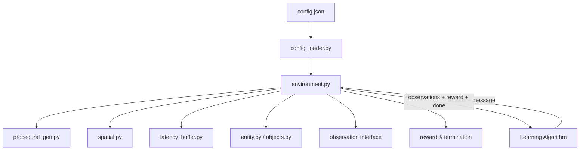

# Design Document: Dec-POMDP Environment

## Overview

This document describes the technical design for the asymmetric Decentralized Partially Observable Markov Decision Process (Dec-POMDP) grid environment. The system simulates a 64×64 discrete coordinate world in which two agents with strictly asymmetric roles must cooperate to capture a target via a latency-buffered communication channel.

The environment is formalized as the tuple ⟨𝒮, 𝒜, 𝒵, 𝒯, 𝒪, ℛ, γ⟩ where:

- **𝒮**: 64×64 discrete grid with procedurally placed obstacles and a target
- **𝒜 = 𝒜_A × 𝒜_B**: Agent A has no movement action (pure communicator); Agent B has 8 discrete movement actions
- **𝒵 = 𝒵_A × 𝒵_B**: Agent A observes full state z_A = s; Agent B observes nothing z_B = ∅
- **𝒯**: Deterministic transition dynamics (movement + collision)
- **𝒪**: Asymmetric observation function
- **ℛ**: Joint reward on target capture
- **γ**: Discount factor (external to environment)

The environment is fully decoupled from any learning algorithm. All parameters are loaded from a JSON config file at initialization.

### Key Design Goals

- Strict separation between environment logic and learning code
- Reproducible episodes via seeded procedural generation
- Correct FIFO latency buffer implementing τ-step message delay
- Efficient O(1) spatial indexing for collision detection
- Extensible entity hierarchy requiring no core changes for new types

---

## Architecture

The environment is implemented as a set of Python modules with clear single responsibilities. No module imports from learning algorithm code.



### Module Responsibilities

| Module | Responsibility |
|---|---|
| `config_loader.py` | Parse and validate JSON config; raise descriptive errors on missing/invalid fields |
| `environment.py` | Orchestrate the step pipeline, reset, and episode lifecycle |
| `entity.py` | Base `Entity` class with id, position, `static`, `collidable` flags |
| `objects.py` | Concrete entity types: `AgentA`, `AgentB`, `Obstacle`, `Target` |
| `spatial.py` | `SpatialIndex` — dict-based O(1) position→entity-set mapping |
| `latency_buffer.py` | FIFO queue implementing τ-step message delay |
| `procedural_gen.py` | Seeded random placement of all entities with overlap/separation checks |
| `debug.py` | Optional text-grid renderer and state-dump utility |

---

## Components and Interfaces

### ConfigLoader

```python
class ConfigLoader:
    def load(path: str) -> EnvConfig
    # Raises: FileNotFoundError, ConfigValidationError (with field name)
```

`EnvConfig` is a dataclass holding all validated parameters. Any missing or type-invalid field raises `ConfigValidationError` naming the offending field.

### Environment

The central orchestrator. Exposes the standard RL environment interface:

```python
class DecPOMDPEnvironment:
    def __init__(self, config_path: str): ...
    def reset(self, seed: int | None = None) -> tuple[ObsA, ObsB]: ...
    def step(self, action_b: int, message_a: list[float]) -> StepResult: ...
    def state_dict(self) -> dict: ...  # full state dump
```

`StepResult = namedtuple("StepResult", ["obs_a", "obs_b", "reward", "terminated", "info"])`

The `step` method raises `EpisodeTerminatedError` if called on a terminated episode.

### Entity Hierarchy

```
Entity (abstract)
├── AgentA       static=False, collidable=False  (no movement action)
├── AgentB       static=False, collidable=True
├── Obstacle     static=True,  collidable=True
└── Target       static=True,  collidable=False
```

All entities implement:

```python
@dataclass
class Entity:
    id: str
    x: int
    y: int
    static: bool
    collidable: bool
```

### SpatialIndex

```python
class SpatialIndex:
    def add(entity: Entity) -> None
    def remove(entity: Entity) -> None
    def move(entity: Entity, new_x: int, new_y: int) -> None  # atomic
    def get(x: int, y: int) -> frozenset[Entity]
    def has_collidable(x: int, y: int) -> bool
```

Backed by `dict[tuple[int,int], set[Entity]]`. All operations are O(1) average.

### LatencyBuffer

```python
class LatencyBuffer:
    def __init__(self, tau: int, message_dim: int = 16): ...
    def push(message: list[float]) -> None
    def pop() -> list[float]   # returns zero vector if buffer not yet full
```

Internally a `collections.deque` of fixed capacity `tau + 1`. On `pop`, if fewer than `tau` messages have been pushed, returns `[0.0] * 16`.

### ProceduralGenerator

```python
class ProceduralGenerator:
    def __init__(self, config: EnvConfig): ...
    def generate(seed: int) -> list[Entity]
    # Guarantees: no overlapping collidable entities, AgentB ≠ Target position,
    #             min_separation enforced if configured
```

Uses Python's `random.Random(seed)` instance (not global state) for full reproducibility.

### Observation Interface

```python
# Agent A: full state
ObsA = {
    "agent_a": (x, y),
    "agent_b": (x, y),
    "target":  (x, y),
    "obstacles": [(x, y), ...],   # sorted for determinism
    "timestep": int
}

# Agent B: empty (no environment state)
ObsB = {}
```

Agent B's policy receives only the message delivered by the `LatencyBuffer`, which is managed externally by the learning algorithm. The environment returns `ObsB = {}` to make the zero-information constraint explicit.

---

## Data Models

### EnvConfig (dataclass)

```python
@dataclass
class EnvConfig:
    grid_width:      int    # default 64
    grid_height:     int    # default 64
    num_obstacles:   int
    random_seed:     int
    max_steps:       int
    tau:             int    # communication latency in timesteps
    min_separation:  int    # optional, default 0
    message_dim:     int    # fixed at 16
    debug:           bool   # default False
    log_level:       str    # "DEBUG" | "INFO" | "WARNING"
```

### JSON Config Schema

```json
{
  "grid_width": 64,
  "grid_height": 64,
  "num_obstacles": 20,
  "random_seed": 42,
  "max_steps": 500,
  "tau": 3,
  "min_separation": 5,
  "message_dim": 16,
  "debug": false,
  "log_level": "INFO"
}
```

Required fields: `grid_width`, `grid_height`, `num_obstacles`, `random_seed`, `max_steps`, `tau`.  
Optional fields with defaults: `min_separation` (0), `message_dim` (16), `debug` (false), `log_level` ("INFO").

### Action Space

Agent B's 8-directional action space:

| Action Index | Direction | (Δx, Δy) |
|---|---|---|
| 0 | N  | (0, +1)  |
| 1 | NE | (+1, +1) |
| 2 | E  | (+1, 0)  |
| 3 | SE | (+1, -1) |
| 4 | S  | (0, -1)  |
| 5 | SW | (-1, -1) |
| 6 | W  | (-1, 0)  |
| 7 | NW | (-1, +1) |

### Step Pipeline (ordered)

```
step(action_b, message_a):
  1. Validate episode is active; raise EpisodeTerminatedError if not
  2. Validate message_a has length 16; raise MessageDimensionError if not
  3. latency_buffer.push(message_a)
  4. delayed_msg = latency_buffer.pop()
  5. candidate = agent_b.pos + ACTION_DELTAS[action_b]
  6. if in_bounds(candidate) and not spatial_index.has_collidable(candidate):
       spatial_index.move(agent_b, candidate)
  7. timestep += 1
  8. reward, terminated = compute_reward_and_termination()
  9. obs_a, obs_b = generate_observations()
  10. return StepResult(obs_a, obs_b, reward, terminated, {"message": delayed_msg})
```

The delayed message is returned in `info["message"]` so the learning algorithm can feed it to Agent B's policy.

### Reward and Termination Logic

```
compute_reward_and_termination():
  if agent_b.pos == target.pos:          # Capture
    return (+1.0, True)
  if timestep >= max_steps:              # Timeout
    return (0.0, True)
  return (0.0, False)                    # Ongoing
```

---

## Correctness Properties

*A property is a characteristic or behavior that should hold true across all valid executions of a system — essentially, a formal statement about what the system should do. Properties serve as the bridge between human-readable specifications and machine-verifiable correctness guarantees.*


### Property 1: Config Error Names the Offending Field

*For any* required config field, if that field is absent or has an invalid type in the JSON config, the `ConfigValidationError` raised SHALL contain the name of that field in its message.

**Validates: Requirements 1.3**

---

### Property 2: Reproducibility — Same Seed Produces Identical Layout

*For any* valid config and any integer seed, calling `reset(seed)` twice SHALL produce identical entity positions for all entities (Agent A, Agent B, Target, all Obstacles).

**Validates: Requirements 1.4, 7.2, 7.3, 13.4**

---

### Property 3: All Entities Within Grid Bounds After Reset

*For any* valid config and any seed, after `reset()`, every entity's (x, y) position SHALL satisfy `0 ≤ x < grid_width` and `0 ≤ y < grid_height`.

**Validates: Requirements 2.1, 5.2, 7.1**

---

### Property 4: Spatial Index Round-Trip

*For any* valid grid position and any entity, after adding the entity to the `SpatialIndex`, querying that position SHALL return a set containing that entity; after removing the entity, querying that position SHALL not contain it.

**Validates: Requirements 4.1**

---

### Property 5: Spatial Index Move Atomicity

*For any* entity and any valid target position, after `SpatialIndex.move(entity, new_x, new_y)`, the entity's old position SHALL not contain it and the new position SHALL contain it.

**Validates: Requirements 4.2**

---

### Property 6: Collision Correctness

*For any* grid position, `SpatialIndex.has_collidable()` SHALL return `True` if and only if at least one collidable entity occupies that position. Agent B's movement to a position where `has_collidable()` is `True` SHALL be rejected (agent stays put); movement to a position where `has_collidable()` is `False` and the position is in-bounds SHALL succeed.

**Validates: Requirements 4.3, 4.4, 6.3, 6.4**

---

### Property 7: Boundary Enforcement

*For any* Agent B position at or near a grid boundary and any action that would produce an out-of-bounds candidate position, Agent B's position SHALL be unchanged after the step.

**Validates: Requirements 2.4, 5.1, 6.4**

---

### Property 8: Initialization Non-Overlap Invariant

*For any* valid config and any seed, after `reset()`: (a) no two collidable entities share the same (x, y) position, and (b) Agent B's position SHALL differ from the Target's position.

**Validates: Requirements 5.3, 7.4**

---

### Property 9: Action Translation Correctness

*For any* action index `a ∈ {0..7}` and any starting position `(x, y)`, the candidate position computed by the environment SHALL equal `(x + Δx, y + Δy)` where `(Δx, Δy)` is the defined delta for action `a`.

**Validates: Requirements 6.2**

---

### Property 10: Minimum Separation Enforced

*For any* valid config with `min_separation > 0` and any seed, after `reset()`, the Manhattan distance between Agent B and the Target SHALL be `≥ min_separation`.

**Validates: Requirements 7.5**

---

### Property 11: Agent A Observation Completeness and Consistency

*For any* environment state and any sequence of steps, Agent A's observation SHALL contain the positions of all entities (Agent A, Agent B, Target, all Obstacles), and the set of keys in `obs_a` SHALL be identical at every timestep within an episode.

**Validates: Requirements 8.1, 8.4**

---

### Property 12: Agent B Observation Is Always Empty

*For any* environment state, Agent B's observation SHALL be an empty structure containing no environment state information.

**Validates: Requirements 8.2**

---

### Property 13: Message Dimension Validation

*For any* list of floats of length exactly 16, `step()` SHALL accept it without raising a dimension error. *For any* list of length ≠ 16, `step()` SHALL raise `MessageDimensionError`.

**Validates: Requirements 9.1, 9.2**

---

### Property 14: Latency Buffer Round-Trip

*For any* message `m` (a list of 16 floats) and any `τ ≥ 0`, pushing `m` into a fresh `LatencyBuffer(tau=τ)` and then calling `pop()` exactly `τ` times (discarding results) followed by one final `pop()` SHALL return a value equal to `m` with no modification.

**Validates: Requirements 9.5, 10.2, 10.4, 10.5**

---

### Property 15: Zero Vector Before Buffer Fills

*For any* `τ > 0`, the first `τ` calls to `pop()` on a freshly initialized `LatencyBuffer` (before any `push`) SHALL return `[0.0] * 16`.

**Validates: Requirements 10.3**

---

### Property 16: Capture Triggers Positive Reward and Termination

*For any* valid environment state where Agent B is moved to the Target's position, the step SHALL return `reward > 0` and `terminated == True`.

**Validates: Requirements 11.1, 11.2**

---

### Property 17: No-Capture Steps Return Zero Reward

*For any* sequence of steps in which Agent B does not occupy the Target's position and the episode has not timed out, every step SHALL return `reward == 0` and `terminated == False`.

**Validates: Requirements 11.4**

---

### Property 18: Timeout Terminates with Zero Reward

*For any* config with `max_steps = N`, after exactly `N` steps without capture, the environment SHALL return `terminated == True` and `reward == 0`.

**Validates: Requirements 11.3**

---

### Property 19: Step on Terminated Episode Raises Error

*For any* terminated episode (by capture or timeout), calling `step()` SHALL raise `EpisodeTerminatedError`.

**Validates: Requirements 11.5, 12.2**

---

### Property 20: Timestep Increments by One Per Step

*For any* sequence of `n` valid steps, `env.timestep` SHALL equal `n` after those steps.

**Validates: Requirements 12.3**

---

### Property 21: Reset Clears State

*For any* environment state (mid-episode or terminated), after `reset()`, the timestep counter SHALL be `0` and the `LatencyBuffer` SHALL be empty (all pops return zero vectors).

**Validates: Requirements 13.1**

---

### Property 22: State Dict Reflects Current Entity Positions

*For any* environment state, `state_dict()` SHALL contain the positions of all entities, and those positions SHALL match the values returned by direct entity position queries.

**Validates: Requirements 14.3**

---

## Error Handling

### Error Types

| Error Class | Trigger | Message Content |
|---|---|---|
| `ConfigValidationError` | Missing or invalid config field | Field name + expected type |
| `FileNotFoundError` | Config file path does not exist | File path |
| `MessageDimensionError` | Message length ≠ 16 | Actual length received |
| `EpisodeTerminatedError` | `step()` called on terminated episode | Instruction to call `reset()` |
| `BoundaryViolationError` | Internal placement outside grid (should not reach user) | Position + grid bounds |

### Error Handling Strategy

- **Config errors** are raised eagerly at `__init__` time, before any entity is created. This ensures the environment never enters a partially-initialized state.
- **Message dimension errors** are raised at the start of `step()` before any state mutation occurs, so the environment state remains consistent.
- **Episode terminated errors** are raised immediately on `step()` entry, preventing any state mutation on a dead episode.
- **Boundary violations** during procedural generation are handled internally by retry logic; they are never surfaced to the caller unless the generator exhausts retries (raises `GenerationFailedError` with seed and config details).
- **Movement OOB / collision** are silent rejections — the agent stays put, no exception is raised. This is intentional: invalid actions are a normal part of the action space.

---

## Testing Strategy

### Dual Testing Approach

Both unit/example-based tests and property-based tests are used. Unit tests cover specific scenarios, integration points, and pipeline ordering. Property tests verify universal invariants across randomized inputs.

### Property-Based Testing

The feature involves pure functions (spatial index operations, latency buffer, action translation, reward computation) with clear input/output behavior and universal properties that hold across a wide input space. PBT is appropriate.

**Library**: [`hypothesis`](https://hypothesis.readthedocs.io/) (Python)

**Configuration**: Minimum 100 examples per property test (`@settings(max_examples=100)`).

**Tag format**: Each property test is tagged with a comment:
```python
# Feature: dec-pomdp-environment, Property N: <property_text>
```

**Properties to implement as PBT** (one test per property):

| Property | Test Focus | Key Generators |
|---|---|---|
| P1: Config error naming | `st.sampled_from(REQUIRED_FIELDS)` | field names |
| P2: Reproducibility | `st.integers()` seeds | seeds, configs |
| P3: Bounds invariant | `st.integers(min_value=0)` seeds | seeds |
| P4: Spatial index round-trip | `st.integers(0,63)` positions | positions, entity ids |
| P5: Move atomicity | positions, entities | positions |
| P6: Collision correctness | positions, collidable flag | entity types |
| P7: Boundary enforcement | boundary positions, actions | positions near edges |
| P8: Init non-overlap | seeds, configs | seeds |
| P9: Action translation | `st.integers(0,7)`, positions | actions, positions |
| P10: Min separation | configs with min_sep > 0, seeds | configs, seeds |
| P11: Obs completeness | seeds, step sequences | seeds |
| P12: Obs_B empty | seeds, step sequences | seeds |
| P13: Message dimension | `st.lists(st.floats())` | list lengths |
| P14: Latency round-trip | messages, tau values | 16-float lists, tau |
| P15: Zero vector early | `st.integers(1, 20)` tau | tau values |
| P16: Capture reward | positions | positions |
| P17: No-capture reward | step sequences | seeds, action sequences |
| P18: Timeout termination | max_steps configs | configs |
| P19: Step on terminated | seeds | seeds |
| P20: Timestep increment | `st.integers(1, 100)` n | step counts |
| P21: Reset clears state | mid-episode states | seeds, step counts |
| P22: State dict accuracy | seeds, step sequences | seeds |

### Unit / Example Tests

- Step pipeline ordering (mock-based, verifying call sequence)
- Entity class hierarchy (`isinstance` checks)
- Debug renderer output format
- Config JSON parsing with all optional fields
- `reset()` returns `(obs_a, obs_b)` tuple
- Custom entity subclass works with `SpatialIndex` without changes
- Custom procedural generator injection

### Test File Structure

```
tests/
├── test_config_loader.py
├── test_spatial_index.py
├── test_latency_buffer.py
├── test_procedural_gen.py
├── test_environment.py       # step pipeline, reset, observations
├── test_reward.py
├── test_movement.py
├── properties/
│   ├── test_prop_config.py
│   ├── test_prop_spatial.py
│   ├── test_prop_latency.py
│   ├── test_prop_environment.py
│   └── test_prop_movement.py
```
